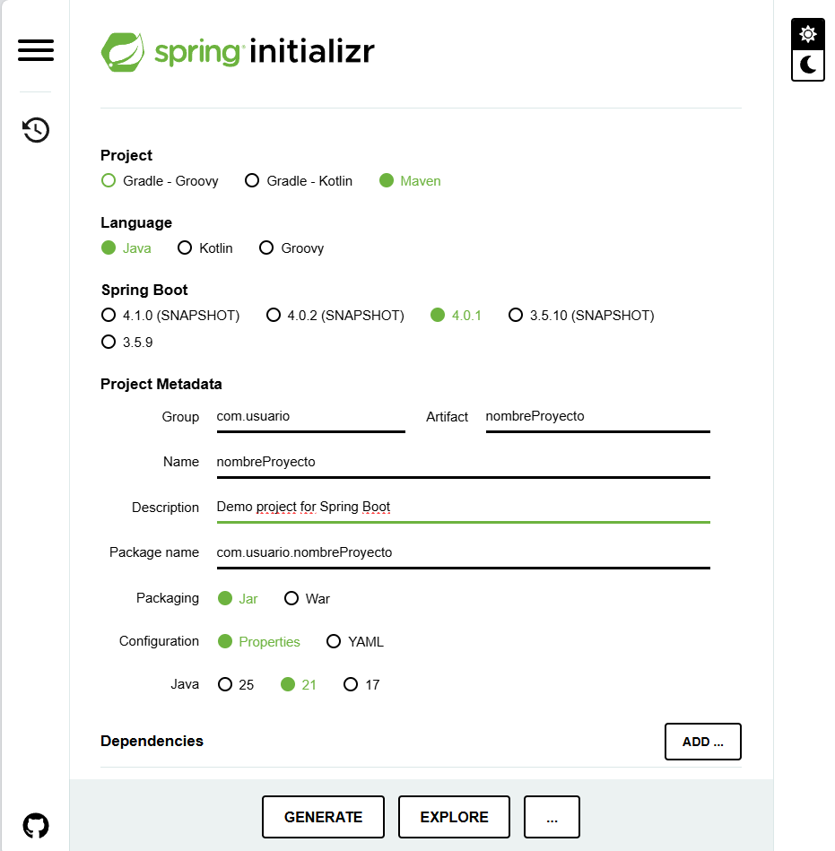
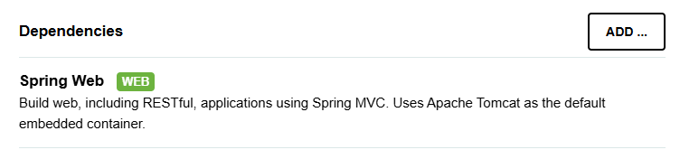
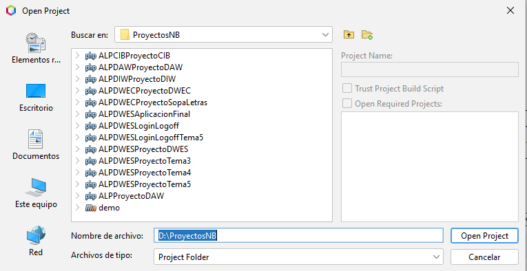
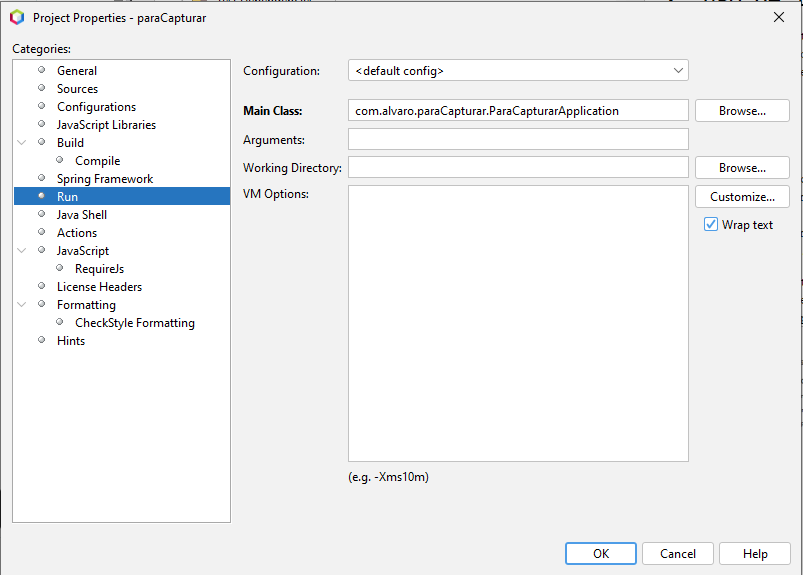
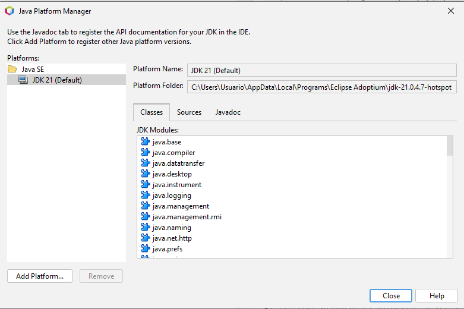
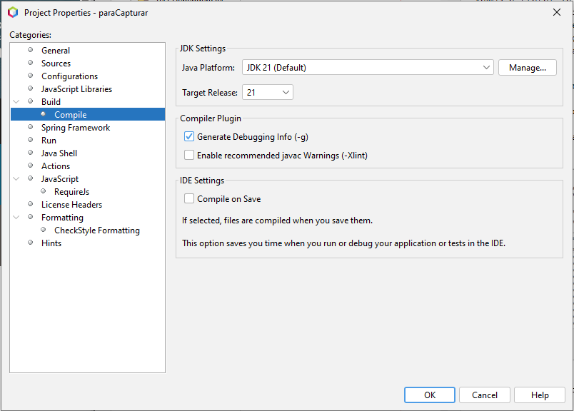
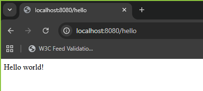
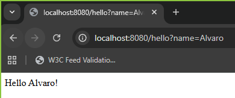
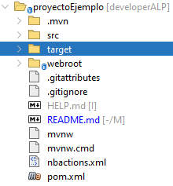

# Guía de creación de proyecto SpringBoot

- [1. Creación de proyecto SpringBoot](#1-creacion-de-proyecto-springboot)
- [2. Uso de IDE con el proyecto](#2-uso-de-ide-con-el-proyecto)
- [3. Ejecución de proyecto en servidor local](#3-ejecucion-de-proyecto-en-servidor-local)
- [4. Estructura de directorios del proyecto](#4-estructura-dedirectorios-del-proyecto)
- [4. Control de versiones](#5-control-de-versiones)

### 1. Creación de proyecto SpringBoot
Nos dirigimos a la página de inicio rápido de SpringBoot: **https://spring.io/quickstart**\
En ella se nos indica como crear un proyecto para su posterior descarga, y a mayores, nos\
muestra un ejemplo de código para comprobar si funciona.

Después de leer detalladamente la página de inicio, entramos en el siguiente enlace para\
configurar el proyecto: **https://start.spring.io/**

Debemos realizar la siguiente configuración:\


**Importante:**\
Debes añadir la siguiente dependencia antes de generar el proyecto:


Al finalizar, deebemos darle a *Generate* y se nos descargará un archivo comprimido.\
Dicho archivo debemos descomprimirlo en el lugar donde queramos guardar nuestros proyectos.

El siguiente paso es abrir el IDE que se haya escogido para desarrollar, en este caso,\
NetBeans y abrimos el proyecto:\


Una vez abierto el proyecto debemos abrir el archivo main y modificar el código para probar\
que funciona el ejemplo propuesto:
```java
package com.example.demo;
import org.springframework.boot.SpringApplication;
import org.springframework.boot.autoconfigure.SpringBootApplication;
import org.springframework.web.bind.annotation.GetMapping;
import org.springframework.web.bind.annotation.RequestParam;
import org.springframework.web.bind.annotation.RestController;

@SpringBootApplication
@RestController
public class DemoApplication {
    public static void main(String[] args) {
      SpringApplication.run(DemoApplication.class, args);
    }
    @GetMapping("/hello")
    public String hello(@RequestParam(value = "name", defaultValue = "World") String name) {
      return String.format("Hello %s!", name);
    }
}
```

Ejecutamos el archivo main... y seguramente nos de algún error. Estos son tratados en el siguiente apartado.

En caso de que no nos de error la ejecución resultará en un servidor local al que accederemos desde un navegador: **localhost:8080/hello**
Se nos sale un "Hola Mundo" es que funciona correctamente.
### 2. Uso de IDE con el proyecto
En este apartado trataremos los posibles errores que surgen a la hora de iniciar el proyecto en NetBeans y como se solucionan.

#### 2.1 Error de configuración de proyecto
Al intentar arrancar el proyecto, a veces puede ocurrir que tengamos una mala configuración de NetBeans\
(sobretodo si usamos otro lenguaje de programación diferente a Java).

Para solventar este problema debemos ir a Properties>Run y en el apartado Main Class seleccionamos el paquete correspondiente.\


Una vez realizado realizamos un Clean del proyecto y ejecutamos el main.

#### 2.2 Versión de JDK incompatible
En caso de tener una versión del JDK distinta a la de SpringBoot tenemos dos opciones:\
- Crear un nuevo proyecto con la versión del JDK que tenemos descargada.
- Descargar la versión del JDK correspondiente y/o en caso de tenerlo, configurar el NetBeans.

Vamos a tratar la segunda opción. Para descargar el JDK debemos ir al sitio oficial: **https://www.oracle.com/java/technologies/downloads/**\
En este caso escogemos la versión 21 y guardamos los archivos en una carpeta al gusto. Importante guardar la ruta.

Abrimos el NetBeans y vamos al apartado **Tools>Java Platforms**\
Se abrirá un cuadro en el que aparecen todas las versiones del JDK tenemos instaladas y nos dará la posibilidad de añadir más.\
En caso de que no aparezca la versión que queremos (en este caso, la 21) debemos añadirla.\


Una vez añadido y comprobado que está la versión correcta, nos dirigimos a **Properties>Build>Compile**\
y comprobamos que el Java Platform tiene la versión correcta:\


Realizamos un Clean al proyecto y ejecutamos el main para probar que funciona.

### 3. Ejecución de proyecto en servidor local
Una vez tengamos el proyecto listo para ejecutar pulsamos la flecha verde que hay en la barra superior de NetBeans y esperamos a que arranque el programa.
En caso de tener varios archivos en el proyecto y, para evitar problemas, debemos iniciar el archivo pulsando click derecho>Run File.

Cuando el programa esté arrancado y no haya dado ningún error podemos ir a un navegador cualquiera y acceder a la funcionalidad con este enlace:
localhost:8080/hello donde localhost:8080 es el servidor local que ha creado el proyecto SpringBoot y /hello es el método que recibe como parámetro un nombre
y muestra un mensaje de bienvenida.

Por tanto, hay dos resultados tras ejecutar este ejercicio:\
**1. localhost:8080/hello (sin parámetros)**\
\
**2. localhost:8080/hello?name=Alvaro (con parámetro name = "Alvaro")**\



### 4. Estructura de directorios del proyecto
Al crear el proyecto se nos descarga un archivo comprimido con todas las carpetas del proyecto organizadas de la siguiente manera:\


> - **/.mvn:** carpeta interna de Maven Wrapper en la que están los archivos que usan Maven sin tener que instalarlo globlalmente y garantizar que todos los desarrolladores tengan la misma versión.
> - **/src/main/java:** es la carpeta más importante ya que contiene el código real de la aplicación: clases, servicios, repositorios y clase principal.
> - **/src/main/resources:** recursos que no son código java como: application.properties o application.yml, archivos de configuración, plantillas y archivos estáticos.
> - **/src/main/webapp:** propia de aplicaciones web tradicionales donde se situan: JSP, HTML, CSS y JS. En SpringBoot no siempre se usa.
> - **/src/test:** código de tests: unitarios o de integración.
> - **/target:** carpeta generada al compilar. Nunca se edita a mano.
> - **/webroot:** no es creada por SpringBoot sino por el usuario para guardar el contenido multimedia, estilos y demás archivos manejados por el desarrollador.
> - **pom.xml:** el archivo más importante después del código donde se define: dependencias, versión de java usada, plugins y tipo de empaquetado.
> - **mvnw y mvnw.cmd:** script de Maven Wrapper para Linux/macOS (el primero), y Windows (el segundo).


### 5. Control de versiones
