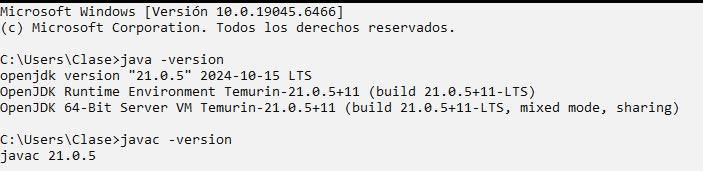
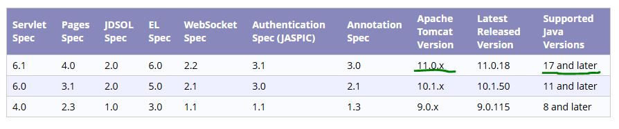
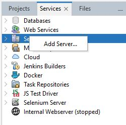
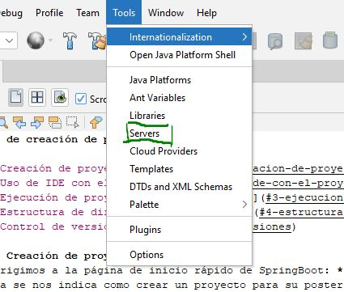
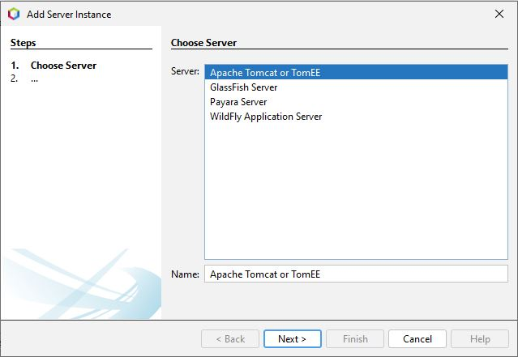
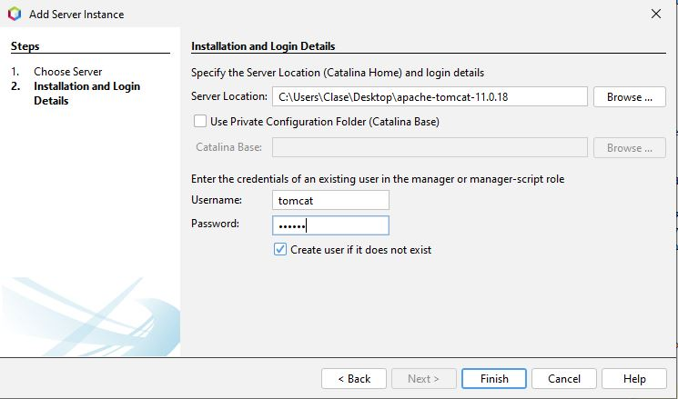

# Guía de montaje de Servidor Tomcat (Windows 11)

- [1. Versión y descarga de Apache Tomcat](#1-version-y-descarga-de-apache-tomcat)
- [2. Integración en NetBeans](#2-integracion-en-netbeans)
- [3. Configuración](#3-configuracion)
- [4. Puesta en marcha](#4-puesta-en-marcha)

### 1. Versión y descarga de Apache Tomcat
El primer paso que debemos realizar es comprobar mediante el uso del cmd la versión descargada de java y de su compilador:
```bash
java -version
javac -version
```


Una vez comprobada la versión nos dirigimos al siguiente enlace de la página oficial de Apache Tomcat: https://tomcat.apache.org/whichversion.html
en el cual se nos indica la mejor versión de Tomcat para nuestro java:\


Buscamos la versión correspondientes y nos descargamos el zip de 64bits. Los descomprimimos en una carpeta cualquiera (debemos recordar la ruta de dicha carpeta).

### 2. Integración en NetBeans
A continuación, en NetBeans, vamos a la pestaña Services>Server>Add Server (click derecho). Se nos abre una ventana donde debemos introducir la ruta del zip descomprimido
y el nombre y contraseña de un usuario administrador que creará NetBeans (este paso es opcional):\





### 3. Configuración
Al igual que en un servidor Apache HTTP, podemos editar algunos archivos de extensión .xml los cuales modifican la configuración del servidor como los usuarios 
administradores, el puerto de acceso al servidor, etc... En nuestro caso debemos modificar al usuario para que pueda acceder a ciertas partes del servidor. 
Esto se debe a que el rol que se le otorga por defecto no da todos los privilegios:


### 4. Puesta en marcha
